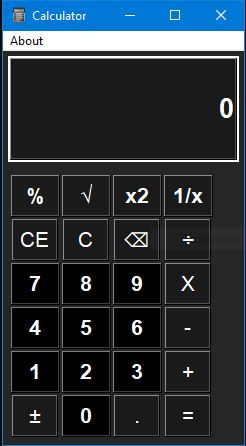

# Basic-Calculator

## Description

Basic Calculator is a gui app developed using python and tkinter framework. It can perform **basic** mathematical operations.

## Screenshot

## Inspiration
Trying to build a clone of **Windows 10** calculator

## Contributing

Pull requests are welcome. For major changes, please open an issue first to discuss what you would like to change.

